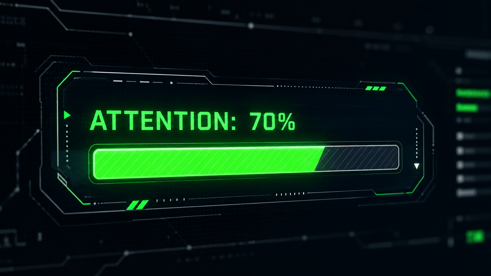
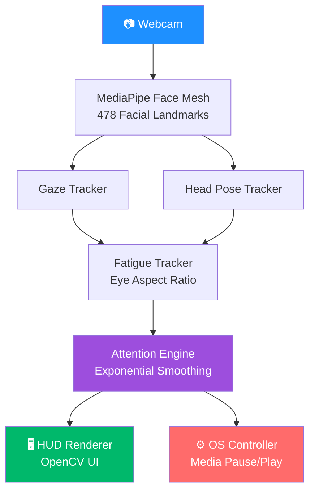

<div align="center">


<br>


<br>


</div>

<br>

<p align="center">
  <a href="#-overview">Overview</a> •
  <a href="#-features">Features</a> •
  <a href="#%EF%B8%8F-preview">Preview</a> •
  <a href="#%EF%B8%8F-architecture">Architecture</a> •
  <a href="#%EF%B8%8F-tech-stack">Tech Stack</a> •
  <a href="#-installation">Installation</a> •
  <a href="#-roadmap">Roadmap</a>
</p>

---

## 🚀 Overview

**NeuroTrack** is an AI-powered computer vision system that estimates a user's cognitive attention level in real time — using nothing more than a standard webcam.

Instead of relying on expensive dedicated eye-tracking hardware, NeuroTrack fuses facial landmarks, gaze estimation, head pose analysis, and blink detection into a single, smooth **Attention Score (0–100)**. When focus drops below a configurable threshold, it can trigger intelligent desktop automation — like pausing your media automatically.

Built with a modular, object-oriented architecture so it's easy to extend with new attention metrics, ML models, or productivity integrations.

---

## ✨ Features

<table>
<tr>
<td width="50%">

🎯 **Real-time gaze estimation**
Tracks eye direction frame-by-frame

👀 **EAR fatigue detection**
Eye Aspect Ratio-based drowsiness signal

🙂 **478-point facial landmarks**
Powered by MediaPipe Face Mesh

🧭 **Head pose estimation**
Yaw & pitch tracking for orientation

</td>
<td width="50%">

📊 **Continuous Attention Score**
Unified 0–100 focus metric

⚡ **Exponential smoothing**
Stable, noise-resistant predictions

🖥️ **Live OpenCV HUD**
Real-time on-screen overlay

⌨️ **Windows automation**
Auto media pause/play on distraction

</td>
</tr>
</table>

---

## 🖥️ Preview

<div align="center">


<sub>Live HUD overlay — no demo video yet, but a GIF/clip is on the way. ⭐ Star the repo to get notified.</sub>
</div>

---

## 🏗️ Architecture



<details>
<summary>📈 Attention Scoring Pipeline</summary>
<br>

The final Attention Score is computed by combining multiple real-time cognitive indicators:

- Eye gaze direction
- Head orientation
- Eye Aspect Ratio (EAR)
- Blink frequency
- Temporal smoothing

Rather than making frame-by-frame decisions, NeuroTrack applies exponential smoothing to reduce noise and produce stable, reliable attention estimates.

</details>

---

## 🛠️ Tech Stack

<div align="center">

</div>

<br>

| Category | Technologies |
|---|---|
| Language | Python 3.11 |
| Computer Vision | OpenCV |
| Landmark Detection | MediaPipe Face Mesh |
| Numerical Computing | NumPy |
| Automation | PyAutoGUI |
| Rendering | OpenCV GUI |
| Platform | Windows |

---

## 📂 Project Structure

```text
Gaze_tracker/
│
├── analyzer/          # Core gaze, pose & fatigue analysis logic
├── assests/           # Images, mockups & architecture diagrams
├── models/             # ML / landmark model files
├── ui/                  # HUD & UI rendering components
├── venv/                # Virtual environment (local, not committed)
│
├── Documentation.pdf   # Project documentation
├── main.py              # Application entry point
├── requirements.txt    # Python dependencies
└── README.md
```

> ℹ️ Adjust this tree if `analyzer/`, `models/`, or `ui/` contain subfolders you'd like called out explicitly.

---

## ⚙️ Installation

```bash
git clone https://github.com/suchindhar/Gaze_tracker.git
cd Gaze_tracker

pip install -r requirements.txt
python main.py
```

---

## 🗺️ Roadmap

- [ ] Face recognition support
- [ ] Personalized attention calibration
- [ ] Machine learning–based cognitive scoring
- [ ] Productivity analytics dashboard
- [ ] Session history & reporting
- [ ] Multi-monitor support
- [ ] Cross-platform automation
- [ ] REST API integration
- [ ] Edge AI optimization

---

## 🎯 Applications

<div align="center">

| 🎓 Online Learning | 💼 Workplace Productivity | 🚗 Driver Monitoring |
|:---:|:---:|:---:|
| **🖥️ HCI Research** | 🏫 Smart Classrooms | ♿ AI Accessibility |

</div>

---

## 👨‍💻 Author

<div align="center">

**Suchindhar**
*AI Engineer · Machine Learning Engineer · Computer Vision & Generative AI Enthusiast*


</div>

---

## ⭐ Support

If this project helped or interested you:

⭐ **Star** the repository · 🍴 **Fork** it · 🧠 **Share feedback**

<div align="center">


### *"Building AI systems that transform perception into intelligent action."*

</div>
